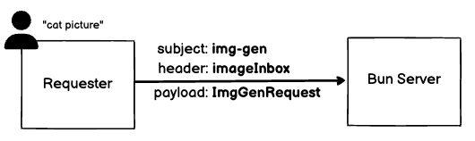
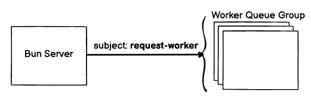
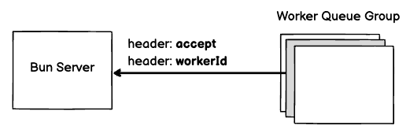
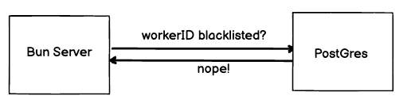
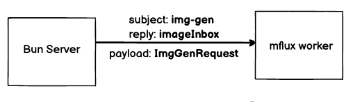
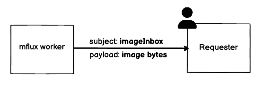

## Introduction

This repository is a prototype of a distributed platform for image generation using the NATs message protocol.

It uses a Bun service to orchestrate the selection of a worker from a pool of workers, and relies entirely on NATs (no HTTP requests involved).

## Overview

There are three components to this project:
1. **server** - a docker-compose stack which has a NATs server, a Bun process (TypeScript), and a Postgres DB.
2. **mflux worker** - a copy of `mflux` wrapped with a NATs client. Multiple instances can be spun up to simulate a pool of workers.
3. **requester** - a simple python script which asks for image prompts from the user (you)

Based on our conversation, you are probably going to be most interested in:
`server/imgGenRequestHandler.ts`

##  Python Setup

You'll want to do these Python setup steps **first**.

Use Python 3.12 (it may work in other Python versions, but no guarantees).
1. `cd` to the root of the repo (which contains `client`, `db` as subfolders)
2. In the root directory of the repo, create a virtual environment: 
   
   `python3 -m venv .venv`
3. Activate the virtual environment: 
   
   `source .venv/bin/activate`
4. Install the project requirements: 
   
   `pip3 install .`
5. Download the HuggingFace models for mflux: 
   
   `python3 worker/download_hf_model.py` 
   
   (HF's included downloader is a little flaky so it may require a restart or two)

    It takes about ~30 mins to download the model and takes about 50GB of disk space.

## Starting The Server

As a prerequisite, you'll need to have Docker installed and the Docker daemon running.
To build and start the server stack:
* Open a new terminal
* Be in the root directory of the repo
* Run `docker compose up`

## Starting Workers and Requester
1. In a new terminal window, **activate the virtual environment first**, and then start a worker: 
   
   `source .venv/bin/activate`

   `python3 worker/worker.py`
2. In a new terminal window, **activate the virtual environment first**, and then start a requester: 
   
    `source .venv/bin/activate`
   
   `python3 requester/requester.py`
3. Repeat (1) a few times to create a pool of workers

You can give a worker a specific ID by using the CLI argument `--worker_id`.  For example:

`python3 worker/worker.py --worker_id blacklisted-worker`

This is useful because I init'd the Postgres DB to contain a single blacklisted worker named `blacklisted-worker`, so the Bun service will refuse to schedule work for a worker created with that `--worker_id`.

## How It Works

When the user enters a generation prompt, height, and width, the requester serializes these parameters into bytes and pubs it to the subject `img-gen`.  

The requester also generates a 1-shot inbox (`imageInbox`) that will eventually receive the generated image from the mflux worker.  The `imageInbox` is included as a field in the header of the `img-gen` pub.

The Bun service is subscribed to `img-gen` subject and fires off an asynchronous handler in response.

The handler reads the `imageInbox` from the header, and the image request payload (prompt, width, height).  These will be used in a bit.  But first, we have to find an available worker from the pool of workers.

The handler requests an available worker from the workers pool by pushing a pub to `request-worker`.  Because each worker in the worker pool is sub'd to `request-worker` as a part of a [queue group](https://docs.nats.io/nats-concepts/core-nats/queue), just one worker out of the pool responds to `request-worker`.  This is how the workload is balanced.

When the randomly selected mflux worker responds to `request-worker`, it identifies itself in the header and also indicates whether it is willing to accept work at this time (it might be busy generating an image already).  

If the header of the selected worker indicates it is already busy, the server discards the selected worker and requests another one by pub'ing `request-worker` again.

(Side note: If we wanted to run multiple image generation requests on a single worker, this simple `accept` boolean flag could be replaced with a number indicating currently available compute power  - although you'd have to account for race conditions by "committing" and "releasing" compute power as part of the negotiation process between server and worker).

Assuming the worker is not busy, the Bun Server takes the identity of the selected worker from the header (`header[workerId]`) and cross-checks it against a list of blacklisted workerIds maintined in the Postgres DB.  If the worker is blacklisted, the Bun server discards the selected worker and requests another worker from the queue group, until this process is successful (until `MAX_ATTEMPTS`).

Finally, the image generation request is sent to the selected mflux worker, with the `reply` field sent to the `imageInbox` generated by the requester when the process started.

When the mflux worker finishes generating the image, it sends the bytes of the generated image directly to the requester, which is deserialized and saved to disk.

I'm glossing over a lot of details.  Here are a few:
1. The Bun Server is *also* pub'd to several of these events, and updates the Postgres database when it receives messages.
2. The requester is pub'd to percent completion events from the worker.

## TODO

1. Implement an image verification scheme and integrate it with the blacklisted workers list
2. Build a JSX-based dashboard for realtime monitoring of the Bun service

## Final Thoughts

If I were building this system less as a weekend project and more for real, I would make different choices:
1. I would make actual UIs for the requester and worker, not just Python scripts.
2. I would *not* use mflux because it only executes on MacOS.  I would find some way to port *flux* itself into a background execution process.
3. I would probably put some kind of write-behind cache between the Bun service and the DB if perf monitoring indicated that the (chatty) DB writes were a bottleneck - I think they might be.
4. I would use NAT's JetStream features because of the delivery guarantees it has.
5. WorkerID would be based off of a device identifier.
6. I would try to allocate workers based on available remaining compute power rather than simply whether or not the worker is currently busy.
7. Security and sybil-proofing would need to be carefully accounted for